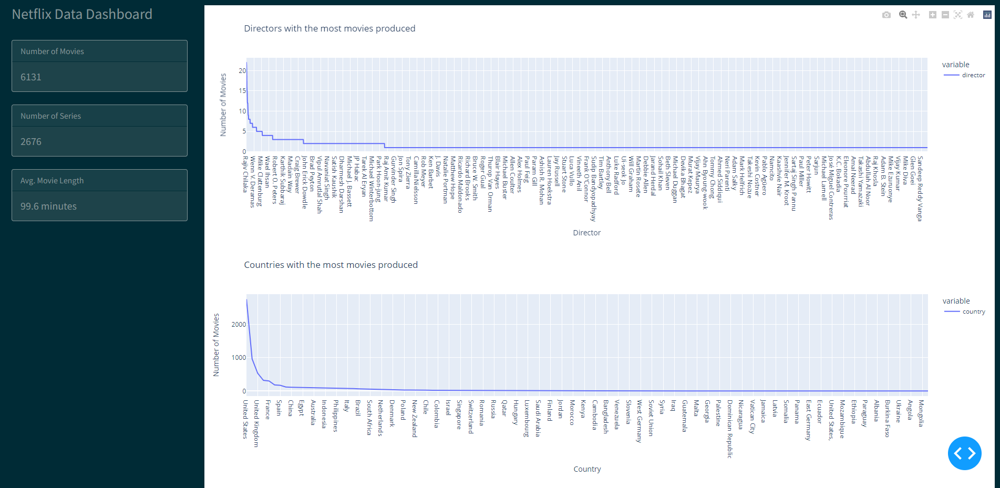

### Netflix Data Dashboard

App contains visualized data from the Netflix movies and series dataset. the user has the ability to zoom and pan around the chart, as most of the charts contain a lot of data.

## Requirements

* Python 3

## How to run this app

I suggest you to create a virtual environment for running this app with Python 3. Clone this repository 
and open your terminal/command prompt in the root folder.

```
git clone https://github.com/shpatkrasniqi/netflix-data-dashboard.git
cd netflix-data-dashboard
python -m venv env

```

In Windows: 

```
env\Scripts\activate
```

Install all required packages by running:
```
pip install -r requirements.txt
```

Run this app locally with:
```
python app.py
```

## Screenshot


